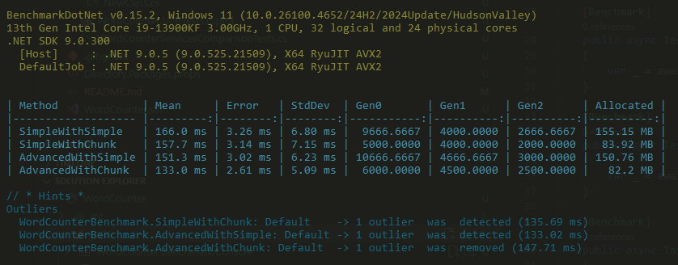
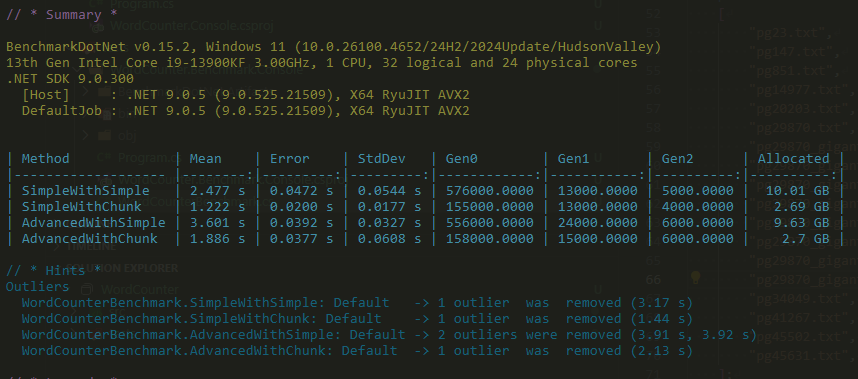

# File Word Counter

There's more than one solution here. The final was proven to be the fastest, and able to handle files no matter their characteristics and count
are [ParallelWordCounterService.cs](src/WordCounter.Console/Services/ParallelWordCounterService.cs) with
[ChunkBasedWordCounter.cs](src/WordCounter.Console/Services/ChunkBasedWordCounter.cs).
These have unit tests only.

## Assumptions and notes

The texts are assumed to be sanitized, not containing non-word characters other by the surrounding whitespaces. (as in the example). If the text is a real text, then everything changes into a direction that the data must be cleaned before processing. On the assumption of large variety of characters can occur, in many variation, example: emojis, urls, decimals with different representations, quotes with different representations, the solution is not exploring how to handle these and assume the text is already through pre-processing.

Normally, I focus more on Unit Testing and the interaction of the abstractions. But as the code is relatively low-level, mainly cause of high performance considerations, pure Unit Tests are harder. And also introducing some integration level tests with real implementations in order to make sure the result is the same and comparable.

## Start the program

The console app is just for helping to test the application.
It takes file paths as parameters, otherwise, takes files from the "files" directory, if run from console.

`dotnet restore` + `dotnet build` to build the solution
`dotnet test` to run all available tests.

`dotnet run --project src\WordCounter.Console\`

## Not very closely to the task

I ran some dotnet benchmarks comparing the four variations of the implementations. Results are interesting, but not surprising.

Ran on some books in txt. File count: ~10, sizes (500k-3MB)

Ran on some books in txt with inflated data. File count: ~20, sizes (500k-60MB)

